# Walkthroughs

Sequence numbers are illustrative.

## Setting up

### Creating a stream

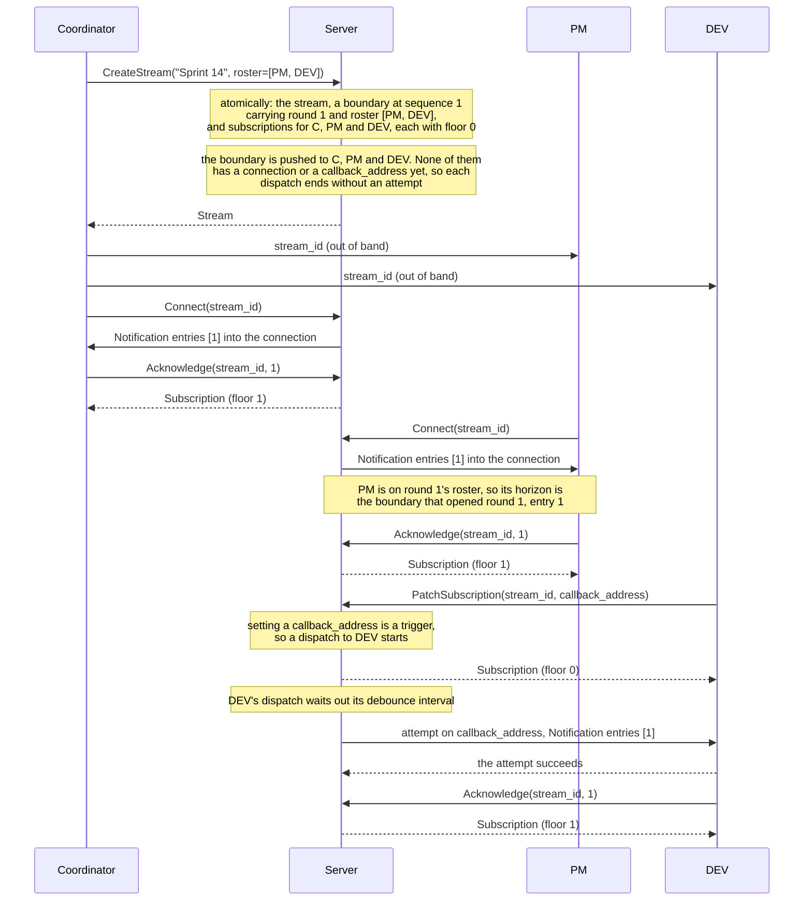
```mermaid
sequenceDiagram
    participant C as Coordinator
    participant S as Server
    participant PM
    participant DEV

    C->>S: CreateStream("Sprint 14", roster=[PM, DEV])
    Note over S: atomically: the stream, a boundary at sequence 1<br/>carrying round 1 and roster [PM, DEV],<br/>and subscriptions for C, PM and DEV, each with floor 0
    Note over S: the boundary is pushed to C, PM and DEV. None of them<br/>has a connection or a callback_address yet, so each<br/>dispatch ends without an attempt
    S-->>C: Stream

    C->>PM: stream_id (out of band)
    C->>DEV: stream_id (out of band)

    C->>S: Connect(stream_id)
    S->>C: Notification entries [1] into the connection
    C->>S: Acknowledge(stream_id, 1)
    S-->>C: Subscription (floor 1)

    PM->>S: Connect(stream_id)
    S->>PM: Notification entries [1] into the connection
    Note over S,PM: PM is on round 1's roster, so its horizon is<br/>the boundary that opened round 1, entry 1
    PM->>S: Acknowledge(stream_id, 1)
    S-->>PM: Subscription (floor 1)

    DEV->>S: PatchSubscription(stream_id, callback_address)
    Note over S: setting a callback_address is a trigger,<br/>so a dispatch to DEV starts
    S-->>DEV: Subscription (floor 0)
    Note over S: DEV's dispatch waits out its debounce interval
    S->>DEV: attempt on callback_address, Notification entries [1]
    DEV-->>S: the attempt succeeds
    DEV->>S: Acknowledge(stream_id, 1)
    S-->>DEV: Subscription (floor 1)
```

### A complete round

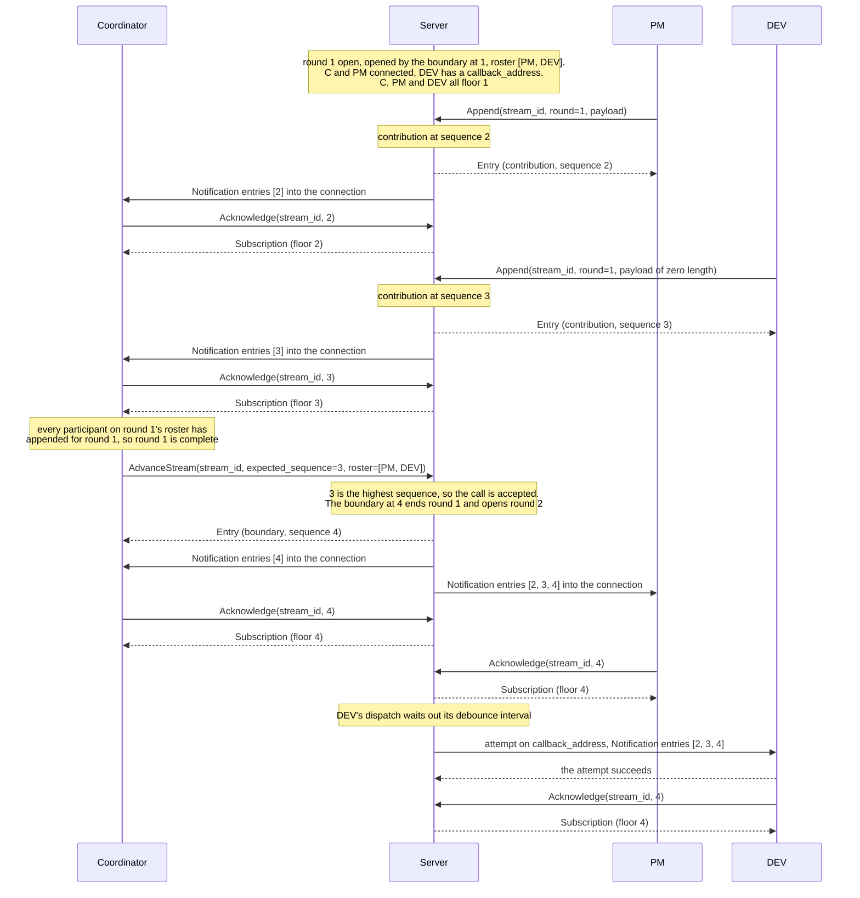
```mermaid
sequenceDiagram
    participant C as Coordinator
    participant S as Server
    participant PM
    participant DEV

    Note over S: round 1 open, opened by the boundary at 1, roster [PM, DEV].<br/>C and PM connected, DEV has a callback_address.<br/>C, PM and DEV all floor 1

    PM->>S: Append(stream_id, round=1, payload)
    Note over S: contribution at sequence 2
    S-->>PM: Entry (contribution, sequence 2)
    S->>C: Notification entries [2] into the connection
    C->>S: Acknowledge(stream_id, 2)
    S-->>C: Subscription (floor 2)

    DEV->>S: Append(stream_id, round=1, payload of zero length)
    Note over S: contribution at sequence 3
    S-->>DEV: Entry (contribution, sequence 3)
    S->>C: Notification entries [3] into the connection
    C->>S: Acknowledge(stream_id, 3)
    S-->>C: Subscription (floor 3)
    Note over C: every participant on round 1's roster has<br/>appended for round 1, so round 1 is complete

    C->>S: AdvanceStream(stream_id, expected_sequence=3, roster=[PM, DEV])
    Note over S: 3 is the highest sequence, so the call is accepted.<br/>The boundary at 4 ends round 1 and opens round 2
    S-->>C: Entry (boundary, sequence 4)
    S->>C: Notification entries [4] into the connection
    S->>PM: Notification entries [2, 3, 4] into the connection
    C->>S: Acknowledge(stream_id, 4)
    S-->>C: Subscription (floor 4)
    PM->>S: Acknowledge(stream_id, 4)
    S-->>PM: Subscription (floor 4)
    Note over S: DEV's dispatch waits out its debounce interval
    S->>DEV: attempt on callback_address, Notification entries [2, 3, 4]
    DEV-->>S: the attempt succeeds
    DEV->>S: Acknowledge(stream_id, 4)
    S-->>DEV: Subscription (floor 4)
```

### Adding a participant

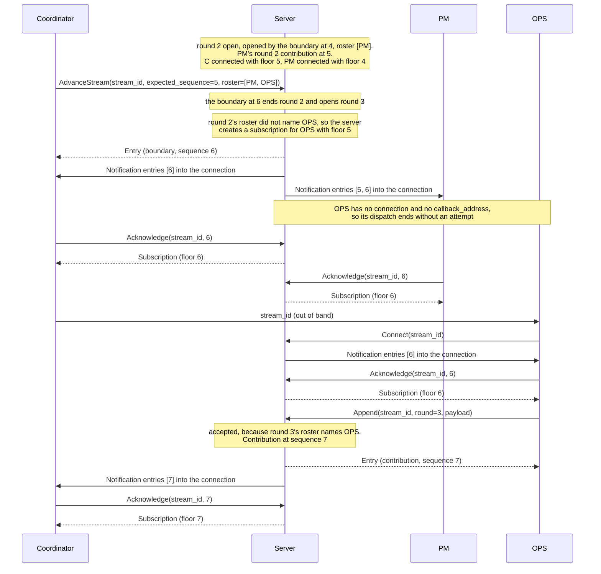
```mermaid
sequenceDiagram
    participant C as Coordinator
    participant S as Server
    participant PM
    participant OPS

    Note over S: round 2 open, opened by the boundary at 4, roster [PM].<br/>PM's round 2 contribution at 5.<br/>C connected with floor 5, PM connected with floor 4

    C->>S: AdvanceStream(stream_id, expected_sequence=5, roster=[PM, OPS])
    Note over S: the boundary at 6 ends round 2 and opens round 3
    Note over S: round 2's roster did not name OPS, so the server<br/>creates a subscription for OPS with floor 5
    S-->>C: Entry (boundary, sequence 6)
    S->>C: Notification entries [6] into the connection
    S->>PM: Notification entries [5, 6] into the connection
    Note over S,OPS: OPS has no connection and no callback_address,<br/>so its dispatch ends without an attempt
    C->>S: Acknowledge(stream_id, 6)
    S-->>C: Subscription (floor 6)
    PM->>S: Acknowledge(stream_id, 6)
    S-->>PM: Subscription (floor 6)

    C->>OPS: stream_id (out of band)
    OPS->>S: Connect(stream_id)
    S->>OPS: Notification entries [6] into the connection
    OPS->>S: Acknowledge(stream_id, 6)
    S-->>OPS: Subscription (floor 6)

    OPS->>S: Append(stream_id, round=3, payload)
    Note over S: accepted, because round 3's roster names OPS.<br/>Contribution at sequence 7
    S-->>OPS: Entry (contribution, sequence 7)
    S->>C: Notification entries [7] into the connection
    C->>S: Acknowledge(stream_id, 7)
    S-->>C: Subscription (floor 7)
```

## Rounds and ordering

### Advancing past an incomplete round

Round 2's roster is [PM, DEV, OPS]. DEV and OPS do not contribute to round 2 before the coordinator advances the stream, and the coordinator leaves OPS off round 3's roster. DEV and OPS append their round 2 contributions during round 3.

While round 3 is current, DEV appends two contributions: one for round 3, and then one for round 2. A participant is allowed to append several contributions while one round is current, if each contribution is for a different round and the participant has not already contributed to that round. OPS appends for round 2 although round 3's roster does not name OPS.

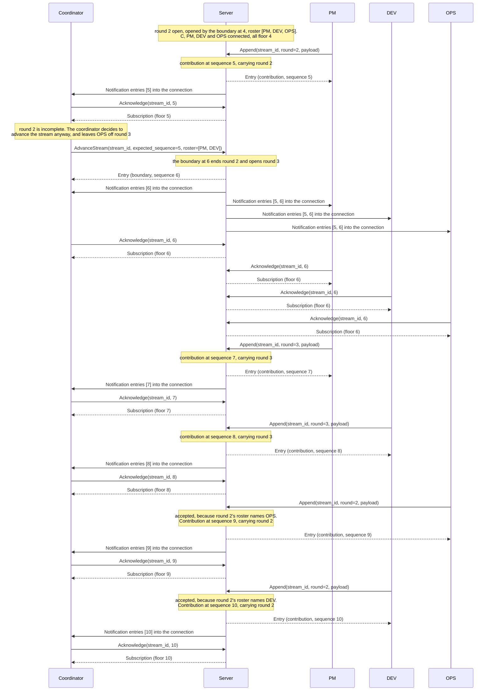
```mermaid
sequenceDiagram
    participant C as Coordinator
    participant S as Server
    participant PM
    participant DEV
    participant OPS

    Note over S: round 2 open, opened by the boundary at 4, roster [PM, DEV, OPS].<br/>C, PM, DEV and OPS connected, all floor 4

    PM->>S: Append(stream_id, round=2, payload)
    Note over S: contribution at sequence 5, carrying round 2
    S-->>PM: Entry (contribution, sequence 5)
    S->>C: Notification entries [5] into the connection
    C->>S: Acknowledge(stream_id, 5)
    S-->>C: Subscription (floor 5)
    Note over C: round 2 is incomplete. The coordinator decides to<br/>advance the stream anyway, and leaves OPS off round 3

    C->>S: AdvanceStream(stream_id, expected_sequence=5, roster=[PM, DEV])
    Note over S: the boundary at 6 ends round 2 and opens round 3
    S-->>C: Entry (boundary, sequence 6)
    S->>C: Notification entries [6] into the connection
    S->>PM: Notification entries [5, 6] into the connection
    S->>DEV: Notification entries [5, 6] into the connection
    S->>OPS: Notification entries [5, 6] into the connection
    C->>S: Acknowledge(stream_id, 6)
    S-->>C: Subscription (floor 6)
    PM->>S: Acknowledge(stream_id, 6)
    S-->>PM: Subscription (floor 6)
    DEV->>S: Acknowledge(stream_id, 6)
    S-->>DEV: Subscription (floor 6)
    OPS->>S: Acknowledge(stream_id, 6)
    S-->>OPS: Subscription (floor 6)

    PM->>S: Append(stream_id, round=3, payload)
    Note over S: contribution at sequence 7, carrying round 3
    S-->>PM: Entry (contribution, sequence 7)
    S->>C: Notification entries [7] into the connection
    C->>S: Acknowledge(stream_id, 7)
    S-->>C: Subscription (floor 7)

    DEV->>S: Append(stream_id, round=3, payload)
    Note over S: contribution at sequence 8, carrying round 3
    S-->>DEV: Entry (contribution, sequence 8)
    S->>C: Notification entries [8] into the connection
    C->>S: Acknowledge(stream_id, 8)
    S-->>C: Subscription (floor 8)

    OPS->>S: Append(stream_id, round=2, payload)
    Note over S: accepted, because round 2's roster names OPS.<br/>Contribution at sequence 9, carrying round 2
    S-->>OPS: Entry (contribution, sequence 9)
    S->>C: Notification entries [9] into the connection
    C->>S: Acknowledge(stream_id, 9)
    S-->>C: Subscription (floor 9)

    DEV->>S: Append(stream_id, round=2, payload)
    Note over S: accepted, because round 2's roster names DEV.<br/>Contribution at sequence 10, carrying round 2
    S-->>DEV: Entry (contribution, sequence 10)
    S->>C: Notification entries [10] into the connection
    C->>S: Acknowledge(stream_id, 10)
    S-->>C: Subscription (floor 10)
```

### Refused appends

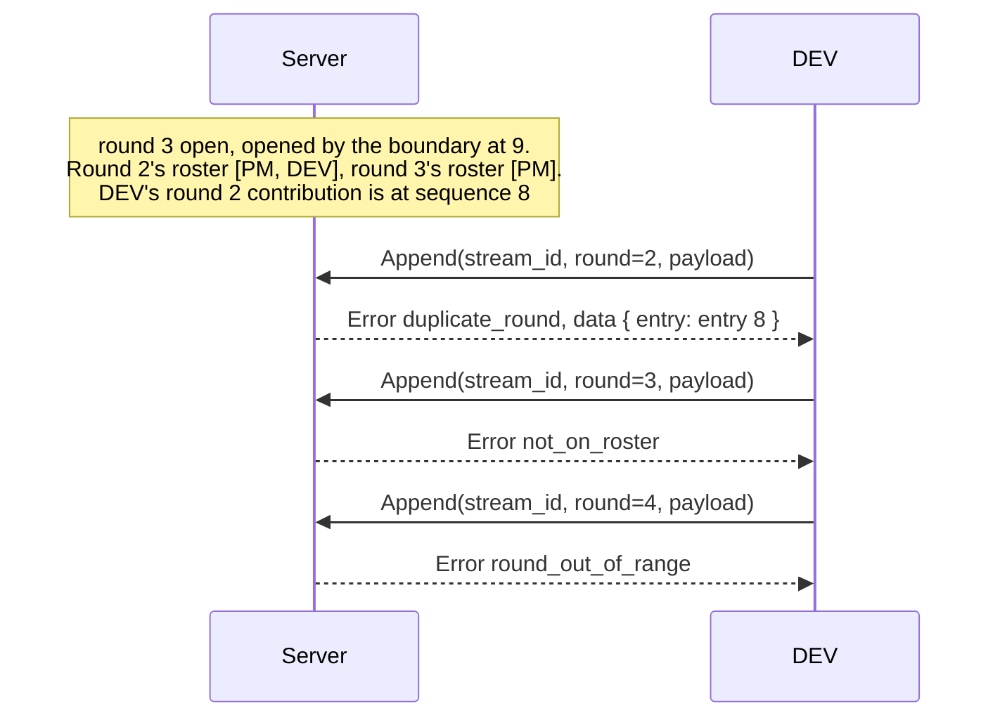
```mermaid
sequenceDiagram
    participant S as Server
    participant DEV

    Note over S: round 3 open, opened by the boundary at 9.<br/>Round 2's roster [PM, DEV], round 3's roster [PM].<br/>DEV's round 2 contribution is at sequence 8

    DEV->>S: Append(stream_id, round=2, payload)
    S-->>DEV: Error duplicate_round, data { entry: entry 8 }
    DEV->>S: Append(stream_id, round=3, payload)
    S-->>DEV: Error not_on_roster
    DEV->>S: Append(stream_id, round=4, payload)
    S-->>DEV: Error round_out_of_range
```

### A lost response to Append

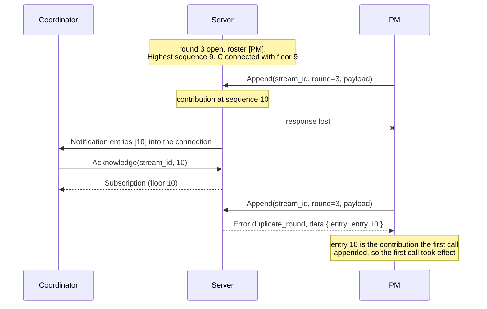
```mermaid
sequenceDiagram
    participant C as Coordinator
    participant S as Server
    participant PM

    Note over S: round 3 open, roster [PM].<br/>Highest sequence 9. C connected with floor 9

    PM->>S: Append(stream_id, round=3, payload)
    Note over S: contribution at sequence 10
    S--xPM: response lost
    S->>C: Notification entries [10] into the connection
    C->>S: Acknowledge(stream_id, 10)
    S-->>C: Subscription (floor 10)

    PM->>S: Append(stream_id, round=3, payload)
    S-->>PM: Error duplicate_round, data { entry: entry 10 }
    Note over PM: entry 10 is the contribution the first call<br/>appended, so the first call took effect
```

### A refused AdvanceStream

DEV appends between the coordinator's last notification and its `AdvanceStream` call.

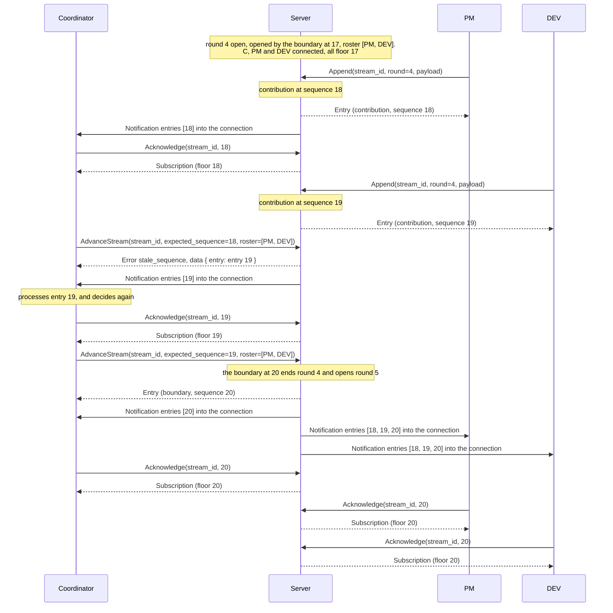
```mermaid
sequenceDiagram
    participant C as Coordinator
    participant S as Server
    participant PM
    participant DEV

    Note over S: round 4 open, opened by the boundary at 17, roster [PM, DEV].<br/>C, PM and DEV connected, all floor 17

    PM->>S: Append(stream_id, round=4, payload)
    Note over S: contribution at sequence 18
    S-->>PM: Entry (contribution, sequence 18)
    S->>C: Notification entries [18] into the connection
    C->>S: Acknowledge(stream_id, 18)
    S-->>C: Subscription (floor 18)

    DEV->>S: Append(stream_id, round=4, payload)
    Note over S: contribution at sequence 19
    S-->>DEV: Entry (contribution, sequence 19)
    C->>S: AdvanceStream(stream_id, expected_sequence=18, roster=[PM, DEV])
    S-->>C: Error stale_sequence, data { entry: entry 19 }
    S->>C: Notification entries [19] into the connection
    Note over C: processes entry 19, and decides again
    C->>S: Acknowledge(stream_id, 19)
    S-->>C: Subscription (floor 19)

    C->>S: AdvanceStream(stream_id, expected_sequence=19, roster=[PM, DEV])
    Note over S: the boundary at 20 ends round 4 and opens round 5
    S-->>C: Entry (boundary, sequence 20)
    S->>C: Notification entries [20] into the connection
    S->>PM: Notification entries [18, 19, 20] into the connection
    S->>DEV: Notification entries [18, 19, 20] into the connection
    C->>S: Acknowledge(stream_id, 20)
    S-->>C: Subscription (floor 20)
    PM->>S: Acknowledge(stream_id, 20)
    S-->>PM: Subscription (floor 20)
    DEV->>S: Acknowledge(stream_id, 20)
    S-->>DEV: Subscription (floor 20)
```

## Notifications

### A notification to a callback address

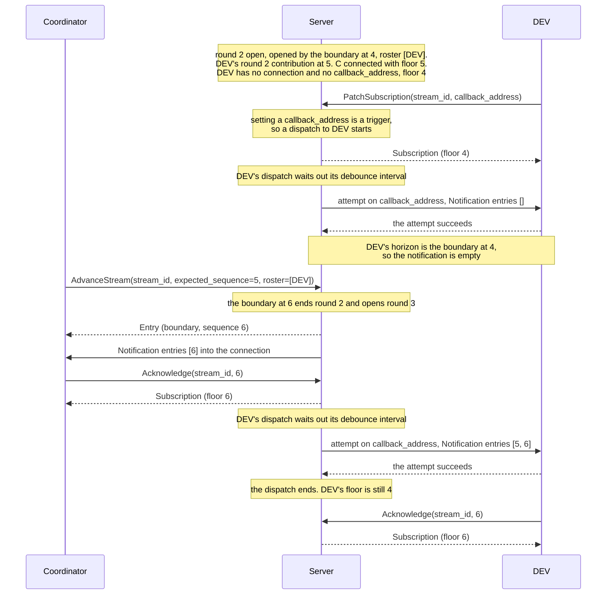
```mermaid
sequenceDiagram
    participant C as Coordinator
    participant S as Server
    participant DEV

    Note over S: round 2 open, opened by the boundary at 4, roster [DEV].<br/>DEV's round 2 contribution at 5. C connected with floor 5.<br/>DEV has no connection and no callback_address, floor 4

    DEV->>S: PatchSubscription(stream_id, callback_address)
    Note over S: setting a callback_address is a trigger,<br/>so a dispatch to DEV starts
    S-->>DEV: Subscription (floor 4)
    Note over S: DEV's dispatch waits out its debounce interval
    S->>DEV: attempt on callback_address, Notification entries []
    DEV-->>S: the attempt succeeds
    Note over S,DEV: DEV's horizon is the boundary at 4,<br/>so the notification is empty

    C->>S: AdvanceStream(stream_id, expected_sequence=5, roster=[DEV])
    Note over S: the boundary at 6 ends round 2 and opens round 3
    S-->>C: Entry (boundary, sequence 6)
    S->>C: Notification entries [6] into the connection
    C->>S: Acknowledge(stream_id, 6)
    S-->>C: Subscription (floor 6)
    Note over S: DEV's dispatch waits out its debounce interval
    S->>DEV: attempt on callback_address, Notification entries [5, 6]
    DEV-->>S: the attempt succeeds
    Note over S: the dispatch ends. DEV's floor is still 4
    DEV->>S: Acknowledge(stream_id, 6)
    S-->>DEV: Subscription (floor 6)
```

### Several triggers during the debounce wait

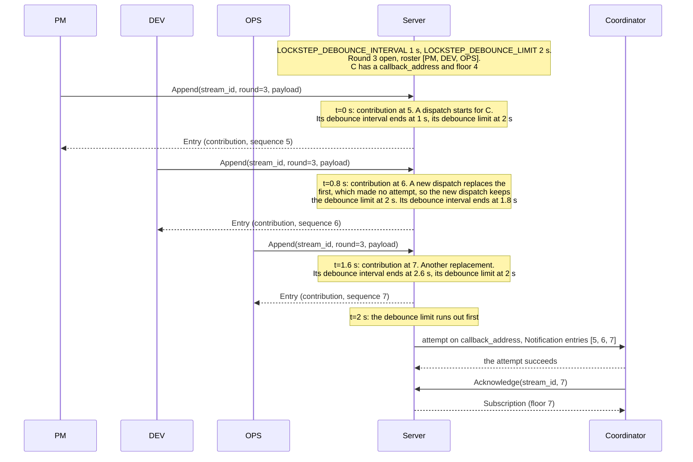
```mermaid
sequenceDiagram
    participant PM
    participant DEV
    participant OPS
    participant S as Server
    participant C as Coordinator

    Note over S: LOCKSTEP_DEBOUNCE_INTERVAL 1 s, LOCKSTEP_DEBOUNCE_LIMIT 2 s.<br/>Round 3 open, roster [PM, DEV, OPS].<br/>C has a callback_address and floor 4
    PM->>S: Append(stream_id, round=3, payload)
    Note over S: t=0 s: contribution at 5. A dispatch starts for C.<br/>Its debounce interval ends at 1 s, its debounce limit at 2 s
    S-->>PM: Entry (contribution, sequence 5)
    DEV->>S: Append(stream_id, round=3, payload)
    Note over S: t=0.8 s: contribution at 6. A new dispatch replaces the<br/>first, which made no attempt, so the new dispatch keeps<br/>the debounce limit at 2 s. Its debounce interval ends at 1.8 s
    S-->>DEV: Entry (contribution, sequence 6)
    OPS->>S: Append(stream_id, round=3, payload)
    Note over S: t=1.6 s: contribution at 7. Another replacement.<br/>Its debounce interval ends at 2.6 s, its debounce limit at 2 s
    S-->>OPS: Entry (contribution, sequence 7)
    Note over S: t=2 s: the debounce limit runs out first
    S->>C: attempt on callback_address, Notification entries [5, 6, 7]
    C-->>S: the attempt succeeds
    C->>S: Acknowledge(stream_id, 7)
    S-->>C: Subscription (floor 7)
```

### A failed attempt and its retries

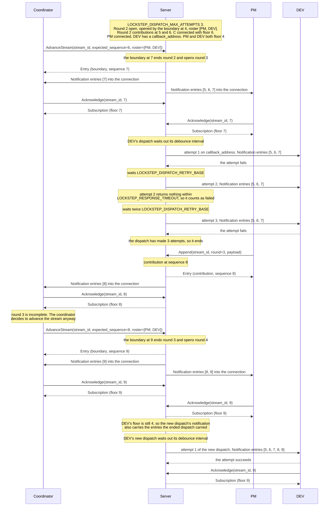
```mermaid
sequenceDiagram
    participant C as Coordinator
    participant S as Server
    participant PM
    participant DEV

    Note over S: LOCKSTEP_DISPATCH_MAX_ATTEMPTS 3.<br/>Round 2 open, opened by the boundary at 4, roster [PM, DEV].<br/>Round 2 contributions at 5 and 6. C connected with floor 6.<br/>PM connected, DEV has a callback_address. PM and DEV both floor 4

    C->>S: AdvanceStream(stream_id, expected_sequence=6, roster=[PM, DEV])
    Note over S: the boundary at 7 ends round 2 and opens round 3
    S-->>C: Entry (boundary, sequence 7)
    S->>C: Notification entries [7] into the connection
    S->>PM: Notification entries [5, 6, 7] into the connection
    C->>S: Acknowledge(stream_id, 7)
    S-->>C: Subscription (floor 7)
    PM->>S: Acknowledge(stream_id, 7)
    S-->>PM: Subscription (floor 7)

    Note over S: DEV's dispatch waits out its debounce interval
    S->>DEV: attempt 1 on callback_address, Notification entries [5, 6, 7]
    DEV-->>S: the attempt fails
    Note over S: waits LOCKSTEP_DISPATCH_RETRY_BASE
    S->>DEV: attempt 2, Notification entries [5, 6, 7]
    Note over S: attempt 2 returns nothing within<br/>LOCKSTEP_RESPONSE_TIMEOUT, so it counts as failed
    Note over S: waits twice LOCKSTEP_DISPATCH_RETRY_BASE
    S->>DEV: attempt 3, Notification entries [5, 6, 7]
    DEV-->>S: the attempt fails
    Note over S: the dispatch has made 3 attempts, so it ends

    PM->>S: Append(stream_id, round=3, payload)
    Note over S: contribution at sequence 8
    S-->>PM: Entry (contribution, sequence 8)
    S->>C: Notification entries [8] into the connection
    C->>S: Acknowledge(stream_id, 8)
    S-->>C: Subscription (floor 8)

    Note over C: round 3 is incomplete. The coordinator<br/>decides to advance the stream anyway
    C->>S: AdvanceStream(stream_id, expected_sequence=8, roster=[PM, DEV])
    Note over S: the boundary at 9 ends round 3 and opens round 4
    S-->>C: Entry (boundary, sequence 9)
    S->>C: Notification entries [9] into the connection
    S->>PM: Notification entries [8, 9] into the connection
    C->>S: Acknowledge(stream_id, 9)
    S-->>C: Subscription (floor 9)
    PM->>S: Acknowledge(stream_id, 9)
    S-->>PM: Subscription (floor 9)
    Note over S: DEV's floor is still 4, so the new dispatch's notification<br/>also carries the entries the ended dispatch carried
    Note over S: DEV's new dispatch waits out its debounce interval
    S->>DEV: attempt 1 of the new dispatch, Notification entries [5, 6, 7, 8, 9]
    DEV-->>S: the attempt succeeds
    DEV->>S: Acknowledge(stream_id, 9)
    S-->>DEV: Subscription (floor 9)
```

### A trigger after a dispatch has made an attempt

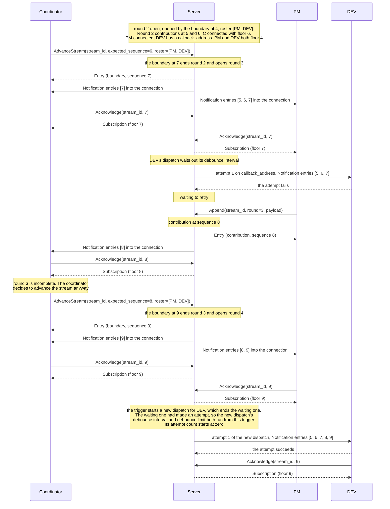
```mermaid
sequenceDiagram
    participant C as Coordinator
    participant S as Server
    participant PM
    participant DEV

    Note over S: round 2 open, opened by the boundary at 4, roster [PM, DEV].<br/>Round 2 contributions at 5 and 6. C connected with floor 6.<br/>PM connected, DEV has a callback_address. PM and DEV both floor 4

    C->>S: AdvanceStream(stream_id, expected_sequence=6, roster=[PM, DEV])
    Note over S: the boundary at 7 ends round 2 and opens round 3
    S-->>C: Entry (boundary, sequence 7)
    S->>C: Notification entries [7] into the connection
    S->>PM: Notification entries [5, 6, 7] into the connection
    C->>S: Acknowledge(stream_id, 7)
    S-->>C: Subscription (floor 7)
    PM->>S: Acknowledge(stream_id, 7)
    S-->>PM: Subscription (floor 7)
    Note over S: DEV's dispatch waits out its debounce interval
    S->>DEV: attempt 1 on callback_address, Notification entries [5, 6, 7]
    DEV-->>S: the attempt fails
    Note over S: waiting to retry

    PM->>S: Append(stream_id, round=3, payload)
    Note over S: contribution at sequence 8
    S-->>PM: Entry (contribution, sequence 8)
    S->>C: Notification entries [8] into the connection
    C->>S: Acknowledge(stream_id, 8)
    S-->>C: Subscription (floor 8)

    Note over C: round 3 is incomplete. The coordinator<br/>decides to advance the stream anyway
    C->>S: AdvanceStream(stream_id, expected_sequence=8, roster=[PM, DEV])
    Note over S: the boundary at 9 ends round 3 and opens round 4
    S-->>C: Entry (boundary, sequence 9)
    S->>C: Notification entries [9] into the connection
    S->>PM: Notification entries [8, 9] into the connection
    C->>S: Acknowledge(stream_id, 9)
    S-->>C: Subscription (floor 9)
    PM->>S: Acknowledge(stream_id, 9)
    S-->>PM: Subscription (floor 9)
    Note over S: the trigger starts a new dispatch for DEV, which ends the waiting one.<br/>The waiting one had made an attempt, so the new dispatch's<br/>debounce interval and debounce limit both run from this trigger.<br/>Its attempt count starts at zero
    S->>DEV: attempt 1 of the new dispatch, Notification entries [5, 6, 7, 8, 9]
    DEV-->>S: the attempt succeeds
    DEV->>S: Acknowledge(stream_id, 9)
    S-->>DEV: Subscription (floor 9)
```

### Changing the callback_address between attempts

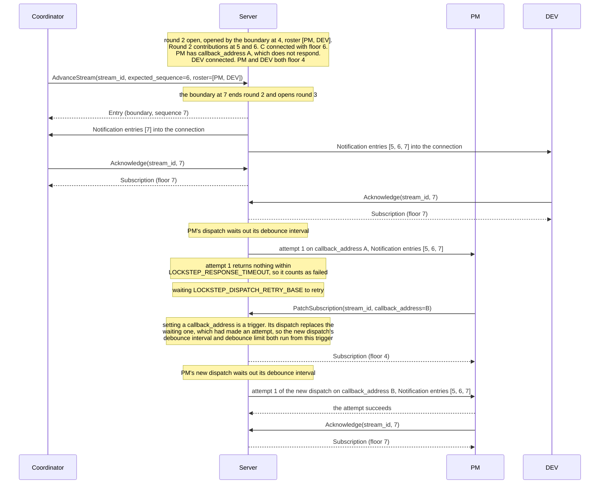
```mermaid
sequenceDiagram
    participant C as Coordinator
    participant S as Server
    participant PM
    participant DEV

    Note over S: round 2 open, opened by the boundary at 4, roster [PM, DEV].<br/>Round 2 contributions at 5 and 6. C connected with floor 6.<br/>PM has callback_address A, which does not respond.<br/>DEV connected. PM and DEV both floor 4

    C->>S: AdvanceStream(stream_id, expected_sequence=6, roster=[PM, DEV])
    Note over S: the boundary at 7 ends round 2 and opens round 3
    S-->>C: Entry (boundary, sequence 7)
    S->>C: Notification entries [7] into the connection
    S->>DEV: Notification entries [5, 6, 7] into the connection
    C->>S: Acknowledge(stream_id, 7)
    S-->>C: Subscription (floor 7)
    DEV->>S: Acknowledge(stream_id, 7)
    S-->>DEV: Subscription (floor 7)

    Note over S: PM's dispatch waits out its debounce interval
    S->>PM: attempt 1 on callback_address A, Notification entries [5, 6, 7]
    Note over S: attempt 1 returns nothing within<br/>LOCKSTEP_RESPONSE_TIMEOUT, so it counts as failed
    Note over S: waiting LOCKSTEP_DISPATCH_RETRY_BASE to retry

    PM->>S: PatchSubscription(stream_id, callback_address=B)
    Note over S: setting a callback_address is a trigger. Its dispatch replaces the<br/>waiting one, which had made an attempt, so the new dispatch's<br/>debounce interval and debounce limit both run from this trigger
    S-->>PM: Subscription (floor 4)

    Note over S: PM's new dispatch waits out its debounce interval
    S->>PM: attempt 1 of the new dispatch on callback_address B, Notification entries [5, 6, 7]
    PM-->>S: the attempt succeeds
    PM->>S: Acknowledge(stream_id, 7)
    S-->>PM: Subscription (floor 7)
```

### Connecting while a dispatch is waiting

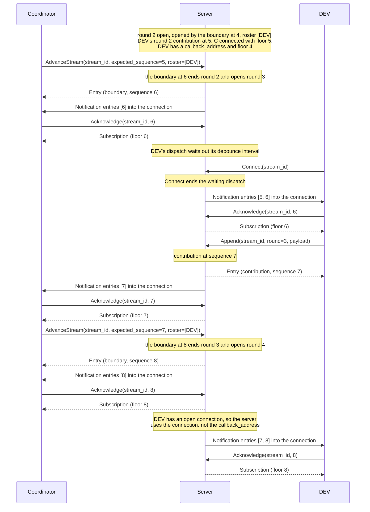
```mermaid
sequenceDiagram
    participant C as Coordinator
    participant S as Server
    participant DEV

    Note over S: round 2 open, opened by the boundary at 4, roster [DEV].<br/>DEV's round 2 contribution at 5. C connected with floor 5.<br/>DEV has a callback_address and floor 4

    C->>S: AdvanceStream(stream_id, expected_sequence=5, roster=[DEV])
    Note over S: the boundary at 6 ends round 2 and opens round 3
    S-->>C: Entry (boundary, sequence 6)
    S->>C: Notification entries [6] into the connection
    C->>S: Acknowledge(stream_id, 6)
    S-->>C: Subscription (floor 6)
    Note over S: DEV's dispatch waits out its debounce interval

    DEV->>S: Connect(stream_id)
    Note over S: Connect ends the waiting dispatch
    S->>DEV: Notification entries [5, 6] into the connection
    DEV->>S: Acknowledge(stream_id, 6)
    S-->>DEV: Subscription (floor 6)

    DEV->>S: Append(stream_id, round=3, payload)
    Note over S: contribution at sequence 7
    S-->>DEV: Entry (contribution, sequence 7)
    S->>C: Notification entries [7] into the connection
    C->>S: Acknowledge(stream_id, 7)
    S-->>C: Subscription (floor 7)

    C->>S: AdvanceStream(stream_id, expected_sequence=7, roster=[DEV])
    Note over S: the boundary at 8 ends round 3 and opens round 4
    S-->>C: Entry (boundary, sequence 8)
    S->>C: Notification entries [8] into the connection
    C->>S: Acknowledge(stream_id, 8)
    S-->>C: Subscription (floor 8)
    Note over S: DEV has an open connection, so the server<br/>uses the connection, not the callback_address
    S->>DEV: Notification entries [7, 8] into the connection
    DEV->>S: Acknowledge(stream_id, 8)
    S-->>DEV: Subscription (floor 8)
```

### Repeat delivery when the subscriber does not acknowledge

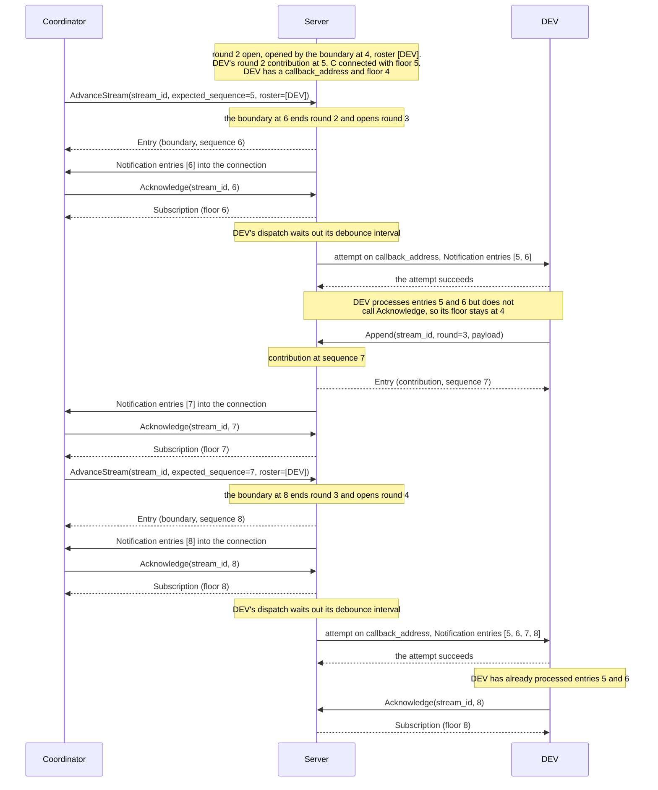
```mermaid
sequenceDiagram
    participant C as Coordinator
    participant S as Server
    participant DEV

    Note over S: round 2 open, opened by the boundary at 4, roster [DEV].<br/>DEV's round 2 contribution at 5. C connected with floor 5.<br/>DEV has a callback_address and floor 4

    C->>S: AdvanceStream(stream_id, expected_sequence=5, roster=[DEV])
    Note over S: the boundary at 6 ends round 2 and opens round 3
    S-->>C: Entry (boundary, sequence 6)
    S->>C: Notification entries [6] into the connection
    C->>S: Acknowledge(stream_id, 6)
    S-->>C: Subscription (floor 6)
    Note over S: DEV's dispatch waits out its debounce interval
    S->>DEV: attempt on callback_address, Notification entries [5, 6]
    DEV-->>S: the attempt succeeds
    Note over S,DEV: DEV processes entries 5 and 6 but does not<br/>call Acknowledge, so its floor stays at 4

    DEV->>S: Append(stream_id, round=3, payload)
    Note over S: contribution at sequence 7
    S-->>DEV: Entry (contribution, sequence 7)
    S->>C: Notification entries [7] into the connection
    C->>S: Acknowledge(stream_id, 7)
    S-->>C: Subscription (floor 7)

    C->>S: AdvanceStream(stream_id, expected_sequence=7, roster=[DEV])
    Note over S: the boundary at 8 ends round 3 and opens round 4
    S-->>C: Entry (boundary, sequence 8)
    S->>C: Notification entries [8] into the connection
    C->>S: Acknowledge(stream_id, 8)
    S-->>C: Subscription (floor 8)
    Note over S: DEV's dispatch waits out its debounce interval
    S->>DEV: attempt on callback_address, Notification entries [5, 6, 7, 8]
    DEV-->>S: the attempt succeeds
    Note over DEV: DEV has already processed entries 5 and 6
    DEV->>S: Acknowledge(stream_id, 8)
    S-->>DEV: Subscription (floor 8)
```

### A dropped connection and a reconnect

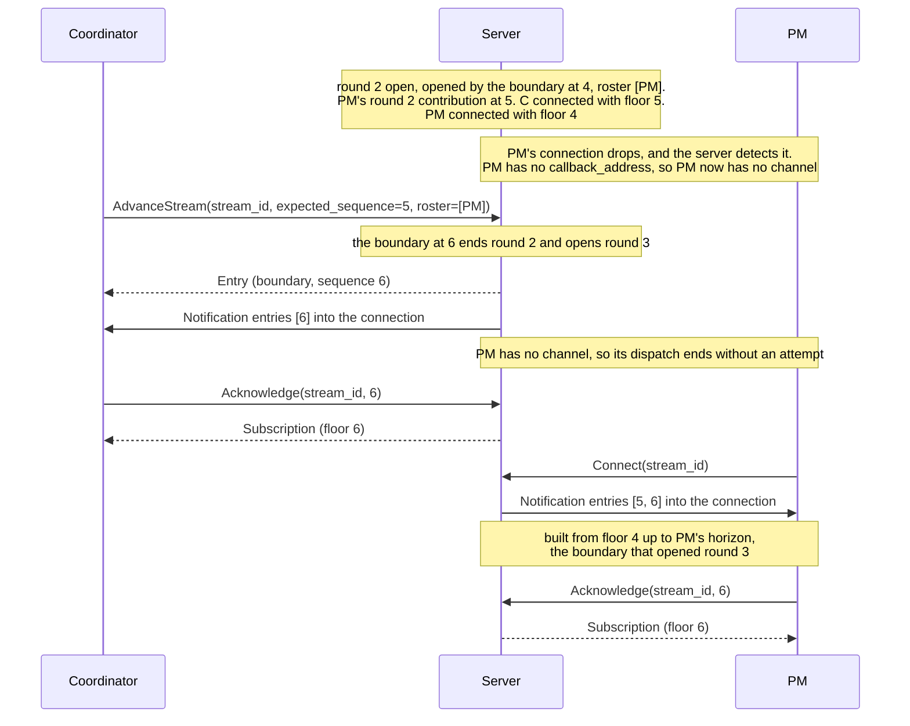
```mermaid
sequenceDiagram
    participant C as Coordinator
    participant S as Server
    participant PM

    Note over S: round 2 open, opened by the boundary at 4, roster [PM].<br/>PM's round 2 contribution at 5. C connected with floor 5.<br/>PM connected with floor 4
    Note over S,PM: PM's connection drops, and the server detects it.<br/>PM has no callback_address, so PM now has no channel

    C->>S: AdvanceStream(stream_id, expected_sequence=5, roster=[PM])
    Note over S: the boundary at 6 ends round 2 and opens round 3
    S-->>C: Entry (boundary, sequence 6)
    S->>C: Notification entries [6] into the connection
    Note over S,PM: PM has no channel, so its dispatch ends without an attempt
    C->>S: Acknowledge(stream_id, 6)
    S-->>C: Subscription (floor 6)

    PM->>S: Connect(stream_id)
    S->>PM: Notification entries [5, 6] into the connection
    Note over S,PM: built from floor 4 up to PM's horizon,<br/>the boundary that opened round 3
    PM->>S: Acknowledge(stream_id, 6)
    S-->>PM: Subscription (floor 6)
```

### A failed write to a connection

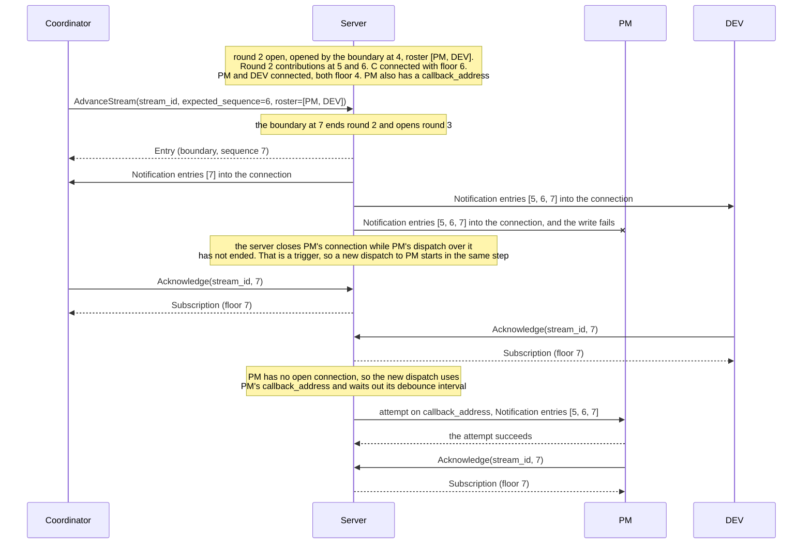
```mermaid
sequenceDiagram
    participant C as Coordinator
    participant S as Server
    participant PM
    participant DEV

    Note over S: round 2 open, opened by the boundary at 4, roster [PM, DEV].<br/>Round 2 contributions at 5 and 6. C connected with floor 6.<br/>PM and DEV connected, both floor 4. PM also has a callback_address

    C->>S: AdvanceStream(stream_id, expected_sequence=6, roster=[PM, DEV])
    Note over S: the boundary at 7 ends round 2 and opens round 3
    S-->>C: Entry (boundary, sequence 7)
    S->>C: Notification entries [7] into the connection
    S->>DEV: Notification entries [5, 6, 7] into the connection
    S-xPM: Notification entries [5, 6, 7] into the connection, and the write fails
    Note over S: the server closes PM's connection while PM's dispatch over it<br/>has not ended. That is a trigger, so a new dispatch to PM starts in the same step
    C->>S: Acknowledge(stream_id, 7)
    S-->>C: Subscription (floor 7)
    DEV->>S: Acknowledge(stream_id, 7)
    S-->>DEV: Subscription (floor 7)

    Note over S: PM has no open connection, so the new dispatch uses<br/>PM's callback_address and waits out its debounce interval
    S->>PM: attempt on callback_address, Notification entries [5, 6, 7]
    PM-->>S: the attempt succeeds
    PM->>S: Acknowledge(stream_id, 7)
    S-->>PM: Subscription (floor 7)
```

### A server restart during a write to a connection

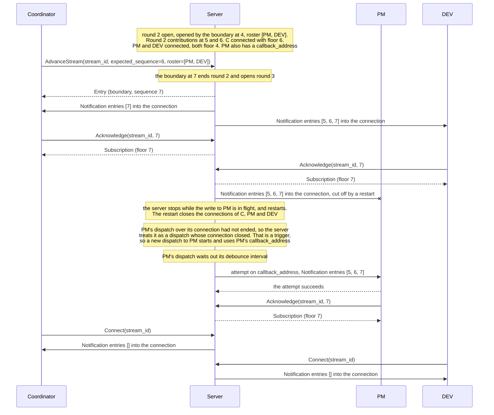
```mermaid
sequenceDiagram
    participant C as Coordinator
    participant S as Server
    participant PM
    participant DEV

    Note over S: round 2 open, opened by the boundary at 4, roster [PM, DEV].<br/>Round 2 contributions at 5 and 6. C connected with floor 6.<br/>PM and DEV connected, both floor 4. PM also has a callback_address

    C->>S: AdvanceStream(stream_id, expected_sequence=6, roster=[PM, DEV])
    Note over S: the boundary at 7 ends round 2 and opens round 3
    S-->>C: Entry (boundary, sequence 7)
    S->>C: Notification entries [7] into the connection
    S->>DEV: Notification entries [5, 6, 7] into the connection
    C->>S: Acknowledge(stream_id, 7)
    S-->>C: Subscription (floor 7)
    DEV->>S: Acknowledge(stream_id, 7)
    S-->>DEV: Subscription (floor 7)
    S-xPM: Notification entries [5, 6, 7] into the connection, cut off by a restart

    Note over S: the server stops while the write to PM is in flight, and restarts.<br/>The restart closes the connections of C, PM and DEV
    Note over S: PM's dispatch over its connection had not ended, so the server<br/>treats it as a dispatch whose connection closed. That is a trigger,<br/>so a new dispatch to PM starts and uses PM's callback_address
    Note over S: PM's dispatch waits out its debounce interval
    S->>PM: attempt on callback_address, Notification entries [5, 6, 7]
    PM-->>S: the attempt succeeds
    PM->>S: Acknowledge(stream_id, 7)
    S-->>PM: Subscription (floor 7)

    C->>S: Connect(stream_id)
    S->>C: Notification entries [] into the connection
    DEV->>S: Connect(stream_id)
    S->>DEV: Notification entries [] into the connection
```

### Polling with no channel

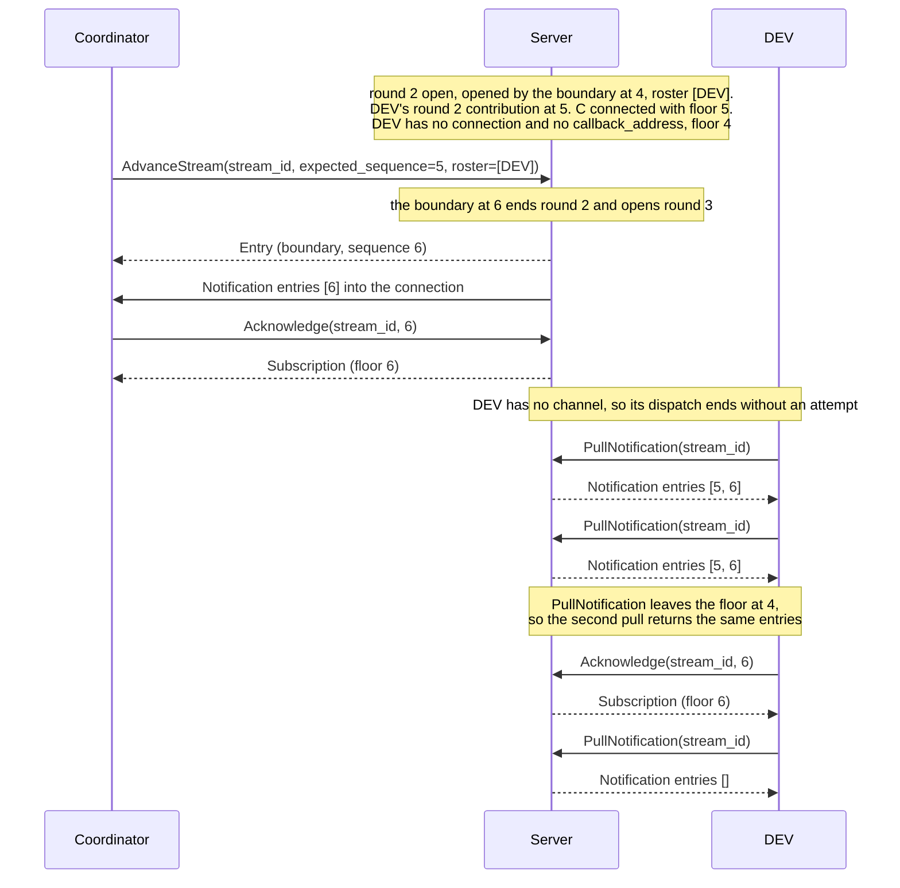
```mermaid
sequenceDiagram
    participant C as Coordinator
    participant S as Server
    participant DEV

    Note over S: round 2 open, opened by the boundary at 4, roster [DEV].<br/>DEV's round 2 contribution at 5. C connected with floor 5.<br/>DEV has no connection and no callback_address, floor 4

    C->>S: AdvanceStream(stream_id, expected_sequence=5, roster=[DEV])
    Note over S: the boundary at 6 ends round 2 and opens round 3
    S-->>C: Entry (boundary, sequence 6)
    S->>C: Notification entries [6] into the connection
    C->>S: Acknowledge(stream_id, 6)
    S-->>C: Subscription (floor 6)
    Note over S,DEV: DEV has no channel, so its dispatch ends without an attempt

    DEV->>S: PullNotification(stream_id)
    S-->>DEV: Notification entries [5, 6]
    DEV->>S: PullNotification(stream_id)
    S-->>DEV: Notification entries [5, 6]
    Note over S,DEV: PullNotification leaves the floor at 4,<br/>so the second pull returns the same entries
    DEV->>S: Acknowledge(stream_id, 6)
    S-->>DEV: Subscription (floor 6)
    DEV->>S: PullNotification(stream_id)
    S-->>DEV: Notification entries []
```

### A server restart

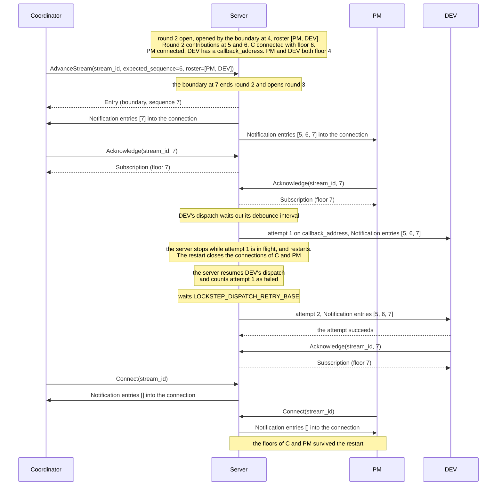
```mermaid
sequenceDiagram
    participant C as Coordinator
    participant S as Server
    participant PM
    participant DEV

    Note over S: round 2 open, opened by the boundary at 4, roster [PM, DEV].<br/>Round 2 contributions at 5 and 6. C connected with floor 6.<br/>PM connected, DEV has a callback_address. PM and DEV both floor 4

    C->>S: AdvanceStream(stream_id, expected_sequence=6, roster=[PM, DEV])
    Note over S: the boundary at 7 ends round 2 and opens round 3
    S-->>C: Entry (boundary, sequence 7)
    S->>C: Notification entries [7] into the connection
    S->>PM: Notification entries [5, 6, 7] into the connection
    C->>S: Acknowledge(stream_id, 7)
    S-->>C: Subscription (floor 7)
    PM->>S: Acknowledge(stream_id, 7)
    S-->>PM: Subscription (floor 7)
    Note over S: DEV's dispatch waits out its debounce interval
    S->>DEV: attempt 1 on callback_address, Notification entries [5, 6, 7]

    Note over S: the server stops while attempt 1 is in flight, and restarts.<br/>The restart closes the connections of C and PM
    Note over S: the server resumes DEV's dispatch<br/>and counts attempt 1 as failed
    Note over S: waits LOCKSTEP_DISPATCH_RETRY_BASE
    S->>DEV: attempt 2, Notification entries [5, 6, 7]
    DEV-->>S: the attempt succeeds
    DEV->>S: Acknowledge(stream_id, 7)
    S-->>DEV: Subscription (floor 7)

    C->>S: Connect(stream_id)
    S->>C: Notification entries [] into the connection
    PM->>S: Connect(stream_id)
    S->>PM: Notification entries [] into the connection
    Note over S,PM: the floors of C and PM survived the restart
```

## Reading

### Reading without a subscription

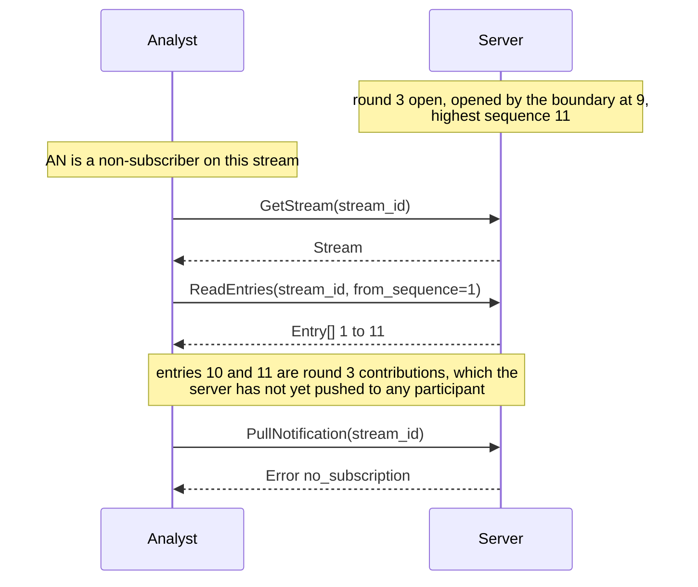
```mermaid
sequenceDiagram
    participant AN as Analyst
    participant S as Server

    Note over S: round 3 open, opened by the boundary at 9,<br/>highest sequence 11
    Note over AN: AN is a non-subscriber on this stream
    AN->>S: GetStream(stream_id)
    S-->>AN: Stream
    AN->>S: ReadEntries(stream_id, from_sequence=1)
    S-->>AN: Entry[] 1 to 11
    Note over S,AN: entries 10 and 11 are round 3 contributions, which the<br/>server has not yet pushed to any participant

    AN->>S: PullNotification(stream_id)
    S-->>AN: Error no_subscription
```

### Finding a stream after a lost response

```mermaid
sequenceDiagram
    participant C as Coordinator
    participant S as Server

    C->>S: CreateStream("Sprint 14", roster=[PM, DEV])
    Note over S: atomically: the stream, its opening boundary<br/>and the subscriptions for C, PM and DEV
    Note over S: the boundary is pushed to C, PM and DEV. None of them<br/>has a channel, so each dispatch ends without an attempt
    S--xC: response lost
    Note over C: the server assigns the stream's id,<br/>so C does not have it
    C->>S: ListSubscribedStreams()
    S-->>C: Stream[] newest created_at first, including "Sprint 14"
    Note over S,C: C holds a subscription on every stream it created,<br/>so the new stream is in the list
```

## Changing the roster

### Dropping a participant

The boundary that leaves DEV off the roster is the last entry the server pushes to DEV.

```mermaid
sequenceDiagram
    participant C as Coordinator
    participant S as Server
    participant PM
    participant DEV

    Note over S: round 3 open, opened by the boundary at 9, roster [PM, DEV].<br/>Entries 10 and 11 are round 3 contributions.<br/>C connected with floor 11, PM and DEV connected with floor 9

    C->>S: AdvanceStream(stream_id, expected_sequence=11, roster=[PM])
    Note over S: the boundary at 12 ends round 3 and opens round 4 with roster [PM]
    S-->>C: Entry (boundary, sequence 12)
    S->>C: Notification entries [12] into the connection
    S->>PM: Notification entries [10, 11, 12] into the connection
    S->>DEV: Notification entries [10, 11, 12] into the connection
    Note over S,DEV: DEV is on the roster of the round entry 12 ends.<br/>Round 3 is the last round whose roster names DEV,<br/>so entry 12 is DEV's horizon
    Note over DEV: entry 12 carries roster [PM],<br/>so DEV is not on round 4's roster
    C->>S: Acknowledge(stream_id, 12)
    S-->>C: Subscription (floor 12)
    PM->>S: Acknowledge(stream_id, 12)
    S-->>PM: Subscription (floor 12)
    DEV->>S: Acknowledge(stream_id, 12)
    S-->>DEV: Subscription (floor 12)

    PM->>S: Append(stream_id, round=4, payload)
    Note over S: contribution at sequence 13
    S-->>PM: Entry (contribution, sequence 13)
    S->>C: Notification entries [13] into the connection
    C->>S: Acknowledge(stream_id, 13)
    S-->>C: Subscription (floor 13)

    C->>S: AdvanceStream(stream_id, expected_sequence=13, roster=[PM])
    Note over S: the boundary at 14 ends round 4 and opens round 5
    S-->>C: Entry (boundary, sequence 14)
    S->>C: Notification entries [14] into the connection
    S->>PM: Notification entries [13, 14] into the connection
    Note over S,DEV: DEV is on neither round 4's nor round 5's roster,<br/>so the server starts no dispatch for DEV
    C->>S: Acknowledge(stream_id, 14)
    S-->>C: Subscription (floor 14)
    PM->>S: Acknowledge(stream_id, 14)
    S-->>PM: Subscription (floor 14)
```

### Adding a participant back

```mermaid
sequenceDiagram
    participant C as Coordinator
    participant S as Server
    participant PM
    participant DEV

    Note over S: round 5 open, opened by the boundary at 14, roster [PM].<br/>PM's round 5 contribution at 15. C connected with floor 15,<br/>PM connected with floor 14. DEV has a callback_address and floor 12

    C->>S: AdvanceStream(stream_id, expected_sequence=15, roster=[PM, DEV])
    Note over S: the boundary at 16 ends round 5 and opens round 6.<br/>Round 5's roster did not name DEV, so DEV's floor is set to 15
    Note over S: DEV already holds a subscription, so the server reuses it<br/>and keeps its callback_address
    S-->>C: Entry (boundary, sequence 16)
    S->>C: Notification entries [16] into the connection
    S->>PM: Notification entries [15, 16] into the connection
    C->>S: Acknowledge(stream_id, 16)
    S-->>C: Subscription (floor 16)
    PM->>S: Acknowledge(stream_id, 16)
    S-->>PM: Subscription (floor 16)
    C->>DEV: stream_id (out of band)

    Note over S: DEV's dispatch waits out its debounce interval
    S->>DEV: attempt on callback_address, Notification entries [16]
    DEV-->>S: the attempt succeeds
    Note over S,DEV: entries 13 to 15 are at or below DEV's new floor,<br/>so the server never pushes them to DEV.<br/>ReadEntries returns them
    DEV->>S: Acknowledge(stream_id, 16)
    S-->>DEV: Subscription (floor 16)
```

### Replacing the coordinator

```mermaid
sequenceDiagram
    participant C1 as Coordinator
    participant S as Server
    participant C2 as New coordinator

    Note over S: highest sequence 20. PM is on a roster.<br/>C1 connected with floor 20
    C1->>S: PatchStream(stream_id, coordinator_id=PM)
    S-->>C1: Error invalid_coordinator

    C1->>S: PatchStream(stream_id, coordinator_id=C2)
    Note over S: C2 holds no subscription on this stream,<br/>so the server creates one for C2 with floor 0
    Note over S: the server ends any dispatch for C1<br/>and closes C1's connection
    Note over S: the handover is a trigger for C2. C2 has no channel,<br/>so its dispatch ends without an attempt
    S-->>C1: Stream (coordinator_id C2)
    C1->>C2: stream_id (out of band)

    C2->>S: Connect(stream_id)
    S->>C2: Notification entries [1 to 20] into the connection
    Note over S,C2: the coordinator's horizon is the latest entry,<br/>and C2's floor is 0, so C2 receives the whole stream.<br/>Entries C1 appended still carry C1 as subscriber_id
    C2->>S: Acknowledge(stream_id, 20)
    S-->>C2: Subscription (floor 20)

    C1->>S: AdvanceStream(stream_id, expected_sequence=20, roster=[PM])
    S-->>C1: Error not_coordinator
    Note over S,C1: C1 keeps its subscription, and is neither the<br/>coordinator nor on a roster, so every notification to C1 is empty
```

## End of life

### Terminating a stream

```mermaid
sequenceDiagram
    participant C as Coordinator
    participant S as Server
    participant PM
    participant DEV

    Note over S: round 4 open, opened by the boundary at 17, roster [PM, DEV].<br/>Round 4 contributions at 18 and 19. C connected with floor 19.<br/>PM connected, DEV has a callback_address. PM and DEV both floor 17

    C->>S: TerminateStream(stream_id, expected_sequence=19)
    Note over S: termination entry at 20, carrying round 4.<br/>to_be_purged_at set to now plus LOCKSTEP_RETENTION
    S-->>C: Entry (termination, sequence 20)
    S->>C: Notification entries [20] into the connection
    S->>PM: Notification entries [18, 19, 20] into the connection
    Note over S: the server closes the connections of C and PM<br/>after writing these notifications
    C->>S: Acknowledge(stream_id, 20)
    S-->>C: Subscription (floor 20)
    PM->>S: Acknowledge(stream_id, 20)
    S-->>PM: Subscription (floor 20)
    Note over S: DEV's dispatch waits out its debounce interval
    S->>DEV: attempt on callback_address, Notification entries [18, 19, 20]
    DEV-->>S: the attempt succeeds
    DEV->>S: Acknowledge(stream_id, 20)
    S-->>DEV: Subscription (floor 20)

    PM->>S: Append(stream_id, round=4, payload)
    S-->>PM: Error stream_terminated
    PM->>S: Connect(stream_id)
    S-->>PM: Error stream_terminated
    C->>S: AdvanceStream(stream_id, expected_sequence=20, roster=[PM, DEV])
    S-->>C: Error stream_terminated
    PM->>S: PullNotification(stream_id)
    S-->>PM: Notification entries []
```

### Purging

```mermaid
sequenceDiagram
    participant C as Coordinator
    participant S as Server
    participant SYS as The server's own schedule

    Note over S: stream terminated by the termination entry at 20,<br/>to_be_purged_at set
    C->>S: ReadEntries(stream_id, from_sequence=1)
    S-->>C: Entry[] 1 to 20
    C->>S: PatchStream(stream_id, to_be_purged_at=null)
    S-->>C: Stream
    C->>S: PatchStream(stream_id, to_be_purged_at=2026-12-01T00:00:00Z)
    S-->>C: Stream

    SYS->>S: PurgeExpiredStreams(), with the server's clock at exactly 2026-12-01T00:00:00Z
    Note over S: the stream's to_be_purged_at is at or before<br/>the server's clock, so the server removes the stream
    S-->>SYS: string[] of the ids removed, including stream_id
    C->>S: GetStream(stream_id)
    S-->>C: Error no_such_stream
```
